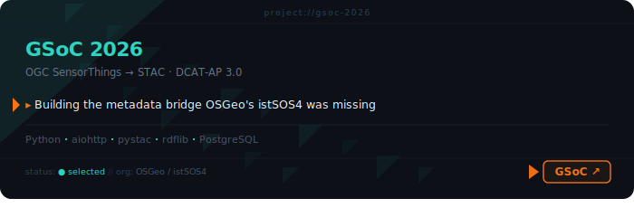
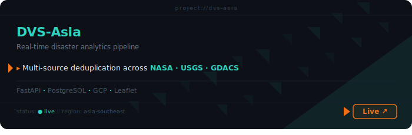
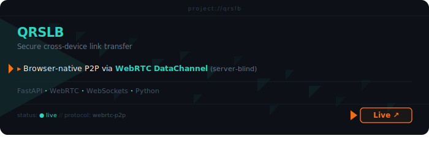
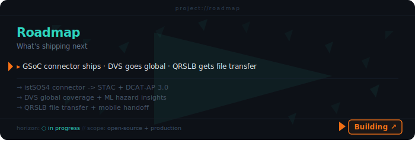

<p align="center">

<!-- ANIMATED HEADER BANNER -->


</p>

<p align="center">
<!-- TYPING ANIMATION -->
<a href="https://git.io/typing-svg">
  
</a>
</p>

<p align="center">
<!-- STATUS BADGES ROW -->

&nbsp;

&nbsp;

</p>

---

<!-- ANIMATED TERMINAL SVG -->
<p align="center">

</p>

---

## `# lore`

```bash
> Vishmayraj ~ Backend Engineer

Specializes in systems where data doesn't sit still.
ETL pipelines, geospatial infrastructure, real-time APIs.

Selected for GSoC 2026 with OSGeo as a second-year student.
Building a metadata connector that bridges OGC SensorThings API
to STAC and DCAT-AP 3.0, making sensor data discoverable
across geospatial browsers and EU open data portals worldwide.

Known for:
- shipping under pressure
- making pipelines that scale before they break
- turning a hackathon weekend into a production system

Current focus:
  istSOS4 metadata connector: harvester + transformer + REST API

Next objective:
  Portfolio website (Phaser)
```

---

## `# missions completed`

<p align="center">
<a href="https://github.com/Vishmayraj/istSOS-MetadataConnector"></a>
</p>
<p align="center">
<a href="https://disasterviz.onrender.com"></a>
</p>
<p align="center">
<a href="https://qrslb.onrender.com"></a>
</p>
<p align="center">
<a href="https://github.com/Vishmayraj?tab=repositories"></a>
</p>

---

## `# loadout`

<table align="center"><tr><td align="center">

<b>Languages</b><br/>
    

<b>Backend &amp; Infra</b><br/>
       

<b>Geospatial &amp; Standards</b><br/>
       

<b>ML &amp; Data</b><br/>
    

</td></tr></table>

---

## `# performance_metrics`

<p align="center">

</p>
<p align="center">

</p>

---

## `# connect`

<p align="center">
<a href="https://linkedin.com/in/vishmayraj-zala-121018336"></a>
<a href="mailto:zalavishmayraj@gmail.com"></a>
<a href="https://instagram.com/notsoteekhipanipuri"></a>
</p>

<!-- FOOTER WAVE -->
