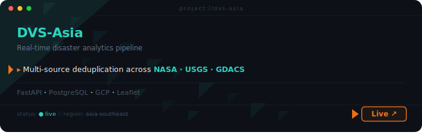
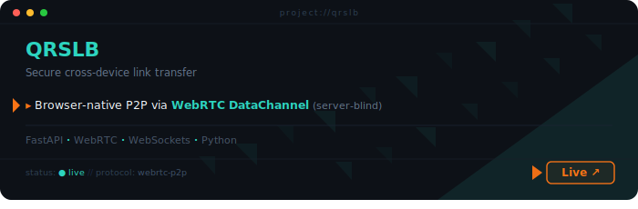
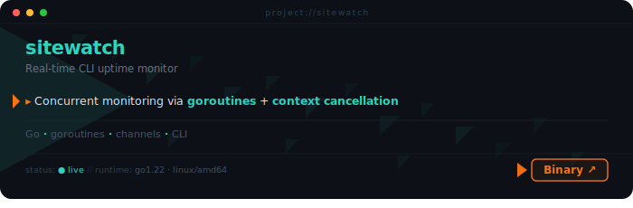
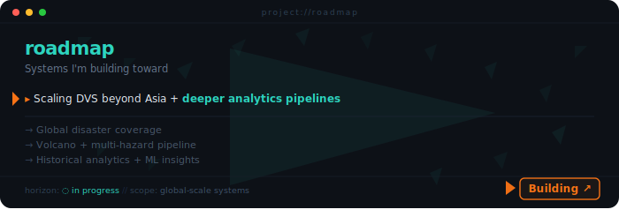

<div align="center">

<!-- ANIMATED HEADER BANNER -->


<!-- TYPING ANIMATION -->
<a href="https://git.io/typing-svg">
  
</a>

<br/>

<!-- STATUS BADGES ROW -->

&nbsp;

&nbsp;


</div>

---

<!-- ANIMATED TERMINAL SVG -->
<div align="center">



</div>

---

## `# player_profile`

<div align="center">



</div>

---

## `# lore`

```bash
> Vishmayraj ~ Backend Engineer

Specializes in building real-time systems where data is not stored,
but constantly in motion.

Known for:
- shipping under pressure
- designing pipelines that scale before they break
- turning hackathon ideas into production systems

Current focus:
→ pushing DVS-Asia into a full-scale disaster intelligence system

Next objective:
→ Portfolio Website (Phaser)
```

---

## `# missions completed`

<div align="center">

<a href="https://disasterviz.onrender.com">
  
</a>
<br/>

<a href="https://qrslb.onrender.com">
  
</a>
<br/>

<a href="https://github.com/Vishmayraj/sitewatch">
  
</a>
<br/>

<a href="https://github.com/Vishmayraj">
  
</a>

</div>

---

## `# loadout`

<div align="center">

**Languages**


**Backend & Infra**


**ML & Data**


</div>

---

## `# performance_metrics`

<div align="center">


</div>

---

## `# connect`

<div align="center">

[](https://linkedin.com/in/vishmayraj-zala-121018336)
[](mailto:zalavishmayraj@gmail.com)
[](https://instagram.com/notsoteekhipanipuri)

<!-- FOOTER WAVE -->


</div>