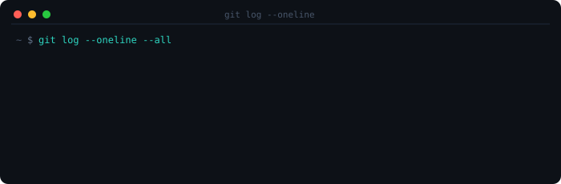

<!-- ANIMATED HEADER BANNER -->

<!-- TYPING ANIMATION -->

<!-- STATUS BADGES ROW -->

&nbsp;

&nbsp;

---

<!-- ANIMATED TERMINAL SVG -->

---

## `# lore`

<table width="100%">
<tr><td width="100%">

Hey, I am Vishmayraj. I am a backend engineer and a B.E. Computer Engineering student at Gujarat Technological University in Ahmedabad, India (2024 to 2028).

I like building things where the data does not just sit still: ETL pipelines, geospatial infrastructure, real-time APIs, the kind of systems that have to keep working while stuff is actively happening to them.

This year I got selected for GSoC 2026 with OSGeo, as a second year student, which still feels a little surreal to say out loud. I built a metadata connector that bridges the OGC SensorThings API to STAC and DCAT-AP 3.0, so sensor data stops being stuck inside one system and becomes something geospatial browsers and EU open data portals can actually find and use.

Right now I am writing up the connector as a research paper. After that, I want to build a portfolio site in Phaser, mostly because it sounds fun.

</td></tr>
</table>

---

## `# missions completed`

<table width="100%">
<tr><td width="100%">

### GSoC 2026: istSOS4 Metadata Connector

**[Final product and full writeup](https://github.com/Vishmayraj/istSOS4/wiki/GSoC-'26-istSOS-Metadata-Connector)**

> Google Summer of Code 2026, OSGeo. [Program page](https://summerofcode.withgoogle.com/programs/2026/projects/UmLEBaWM)

This is the one I am most proud of. I built a FastAPI service that pulls metadata out of istSOS4 through the OGC SensorThings API and turns it into STAC 1.0 and DCAT-AP 3.0 catalogs, so sensor observation data stops being stuck in one silo and becomes something geospatial catalog browsers and EU open data portals can actually pick up and use.

`OGC SensorThings API` `STAC 1.0` `DCAT-AP 3.0` `FastAPI` `PostgreSQL` `Redis`

</td></tr>
</table>

<table width="100%">
<tr><td width="100%">

### DisasterViz Asia

**[Live app](https://disasterviz.onrender.com)**
**[Source Code](https://github.com/Vishmayraj/DVS-Asia)**

A real-time pipeline that pulls in disaster event data across Asia and puts it on a live dashboard, so you can actually see what is happening instead of digging through raw feeds.

`FastAPI` `Supabase` `GitHub Actions` `Render`

</td></tr>
</table>

<table width="100%">
<tr><td width="100%">

### QRSLB

**[Live app](https://qrslb.onrender.com)**
**[Source Code](https://github.com/Vishmayraj/qrslb)**

Send a link from one device to another without it ever passing through a server in between, just a direct WebRTC peer-to-peer connection between the two.

`WebRTC` `FastAPI` `Vanilla JS`

</td></tr>
</table>

---

## `# loadout`

<table align="center"><tr><td align="center">

<b>Languages</b> 
    

<b>Backend &amp; Infra</b> 
       

<b>Geospatial &amp; Standards</b> 
       

<b>ML &amp; Data</b> 
    

</td></tr></table>

---

## `# performance_metrics`

---

## `# connect`

<!-- FOOTER WAVE -->
